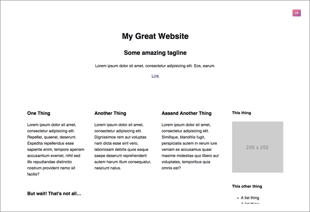

#Layout Scout

__Layout Scout is a visual aid for building responsive layouts.__

[See the demo here](http://lucaslemonnier.com/layoutscout "Layout Scout")

Layout Scout will sniff out the content blocks in your markup and inject random background colours to those blocks. Simply toggle the button on and off to apply/remove the colours. No more hunting through your stylesheet (or dev tools) to apply temporary background colours to your content selectors.

<!-- [layouscout]: /img/ls.gif "Layout Scout" -->


## Getting Started ##

1. Files needed:
```
	layoutscout.js
	main.js
```

2. Call jQuery and add the .js files to your document before your closing body tag (the order is important):

```
	<script src="https://ajax.googleapis.com/ajax/libs/jquery/1.10.2/jquery.min.js"></script>
	<script src="layoutscout.js"></script>
	<script src="main.js"></script>
``` 

## Options ##

Not all designs follow the pattern of dark text on a light background. As such Layoutscout comes with 4 colour palettes to choose from:

- __Light Colours__ - Ideal for dark text / light backgrounds (the default)
- __Dark Colours__ - Ideal for light text / dark backgrounds
- __Light Mono__ - Colour blocks are based on shades of grey up to 50% (if you prefer to have your content highlighted without colour)
- __Dark Mono__ - Colour blocks are based on shades of grey from 50% to 100% (if you prefer to have your content highlighted without colour)

__To choose your colours simply uncomment the one you want:__
```
$(function() {	
	// Uncomment your chosen color option
	$().layoutScout({
 		color: 'lightColours'
 		// color: 'darkColours'
 		// color: 'lightMono'
 		// color: 'darkMono'
 	});
});
```
